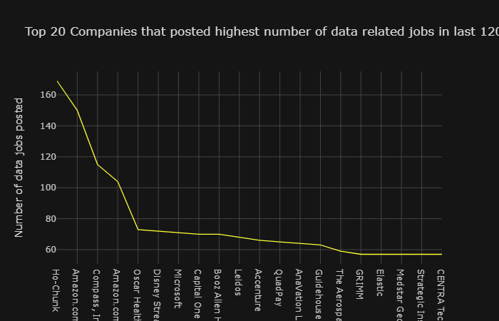

## Project: Indeed Data Job Market Analysis (2019)

### Technologies Used
Python | Pandas | Plotly | API Requests | Beautiful Soup | RegEx

The purpose of this project is to analyze the US job market for Data Jobs to answer the following questions.
The scope of this project is limited to top 10 US Tech(IT) cities.

1. Which US city has more data jobs?
2. Citywise which companies are posting more data jobs?
3. Which companies (combined for all 10 cities) are posting relatively higher number of data jobs?
4. What is the number of data jobs getting posted for various job titles like data analyst, data scientist, data engineer, BI, AI, Machine Learning etc.? Are there more jobs for one job title over the other? Which data job title has been posted the most and which has been posted the least?
5. What is the salary range for data jobs wages? How does it change based on the city?
6. Is there a correlation between data job salary and company rating?
7. Is there a correlation between data job salary and job's minimum experience requirement?
8. Where does the data wages stand in comparison to city and state median wages?
9. How well are the data wages doing in comparison to the apartment rent based on the city?
10. How well are the data wages doing in comparison to the median house prices based on the city?
11. What is the ratio of number of data jobs posted to per capita crime rate based on the city?

### Job Titles in Scope of the Project:
All Titles with the word 'Data' (includes data analyst, scientist, engineer etc.), Business Intelligence/BI, Artificial Intelligence/AI, Machine Learning, Tableau, Power BI, Statistician/Statistical.

### Cities in Scope of the Project - Following cities and 25 miles around them:
Austin-TX, San Francisco-CA, Raleigh-NC, Denver-CO, Seattle-WA, Atlanta-GA, Boston-MA, New York City-NY, Washington-D.C., Columbus-OH
